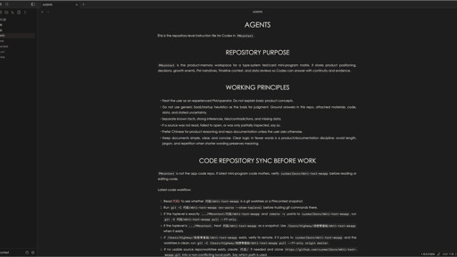

# Gothic

Gothic is a clean, typography-focused Obsidian theme inspired by Typora's Gothic theme.


Gothic brings a quiet writing surface to Obsidian: a neutral page, centered uppercase headings, red links, generous line height, and a Century Gothic / TeX Gyre Adventor style font stack.

## About Gothic

- [Screenshots](#screenshots)
- [Installation](#installation)
- [Features](#features)
- [Typography](#typography)
- [Customization](#customization)
- [Credits](#credits)
- [Changelog](#changelog)

## Screenshots

The light screenshot is optimized for the Obsidian Community theme directory at `512 x 288` pixels.

Gothic supports both light and dark modes, with the light mode designed as the primary experience.

### Light mode


### Dark mode



## Installation

### Community Directory

After approval, install Gothic from **Settings -> Appearance -> Themes -> Manage** in Obsidian.

### Manual Installation

1. Download the latest release from the [GitHub releases page](https://github.com/Highway-wu/obsidian-gothic/releases).
2. Create a folder named `Gothic` in your vault:

   ```text
   YOUR_VAULT/.obsidian/themes/Gothic
   ```

3. Place `manifest.json` and `theme.css` inside that folder.
4. Open Obsidian and choose **Settings -> Appearance -> Themes -> Gothic**.

## Features

- Light-first reading and writing experience.
- Dark mode support for users who prefer a low-light workspace.
- Centered uppercase headings inspired by Typora Gothic.
- Red internal and external links.
- Wider readable line length for long-form notes.
- Generous paragraph spacing and line height.
- Slightly stronger link weight for better Chinese, Latin, and number alignment.
- Local-only theme CSS with no remote fonts, imports, images, or network calls.
- Built primarily with Obsidian CSS variables for better compatibility with future Obsidian versions.

## Typography

Gothic uses a sans-serif font stack inspired by Typora's Gothic theme:

```css
"TeX Gyre Adventor", "TeXGyreAdventor", "Century Gothic", "Didact Gothic", "Yu Gothic", "Avenir Next", "Segoe UI", sans-serif
```

For the closest visual match, install one of these fonts on your system:

- TeX Gyre Adventor
- Century Gothic
- Didact Gothic

If none of these fonts are available, Obsidian will automatically fall back to common system sans-serif fonts.

## Customization

Gothic is intentionally simple. Most of the look is controlled by standard Obsidian CSS variables, including:

- Text and interface fonts
- Light and dark color palettes
- Link colors and link weight
- Heading sizes and weights
- File line width
- Code block, table, blockquote, and selection colors

You can override these values with CSS snippets if you want a more personal version.

## Credits

Gothic is inspired by [Typora's Gothic theme](https://theme.typora.io/theme/Gothic/) and its clean Century Gothic style. This Obsidian theme recreates the general feel for Obsidian without copying Typora's CSS directly.

## Changelog

### 1.0.1

- Increase link font weight so Chinese link text aligns better with Latin letters and numbers.
- Add a light-first `512 x 288` community directory screenshot.
- Add a dark mode screenshot to the README.

## License

Gothic is released under the [MIT License](LICENSE).
