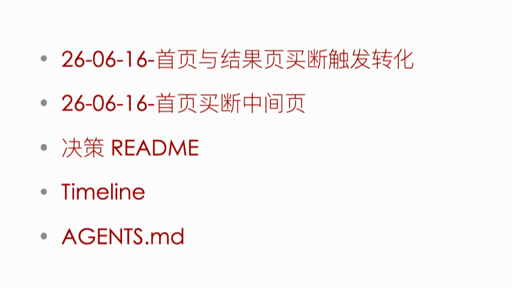

# Gothic

Gothic is a clean writing theme for Obsidian inspired by Typora's Gothic theme.



It focuses on a neutral page, centered uppercase headings, red links, generous line height, and a Century Gothic / TeX Gyre Adventor style font stack.

## Install

### Community Directory

After approval, install Gothic from **Settings -> Appearance -> Themes -> Manage** in Obsidian.

### Manual Install

Place this repository folder in:

```text
YOUR_VAULT/.obsidian/themes/Gothic
```

Then open Obsidian and choose **Settings -> Appearance -> Themes -> Gothic**.

## Notes

- The folder name must match `manifest.json`'s `"name"` value: `Gothic`.
- This theme makes no network requests and does not load remote fonts.
- For a closer Typora Gothic match, install TeX Gyre Adventor, Century Gothic, or Didact Gothic on your system. The theme falls back to common sans-serif fonts if they are unavailable.
- The design intentionally uses Obsidian CSS variables first, with only a few Markdown selectors for centered uppercase headings, justified body text, and link weight.

## Changelog

- `1.0.1`: Increase link font weight so Chinese link text aligns better with Latin letters and numbers.

## Inspiration

Typora Gothic uses a clean neutral page, centered uppercase headings, red links, generous line height, and a Century Gothic / TeX Gyre Adventor style font stack. This theme recreates that feel for Obsidian without copying Typora's CSS directly.
